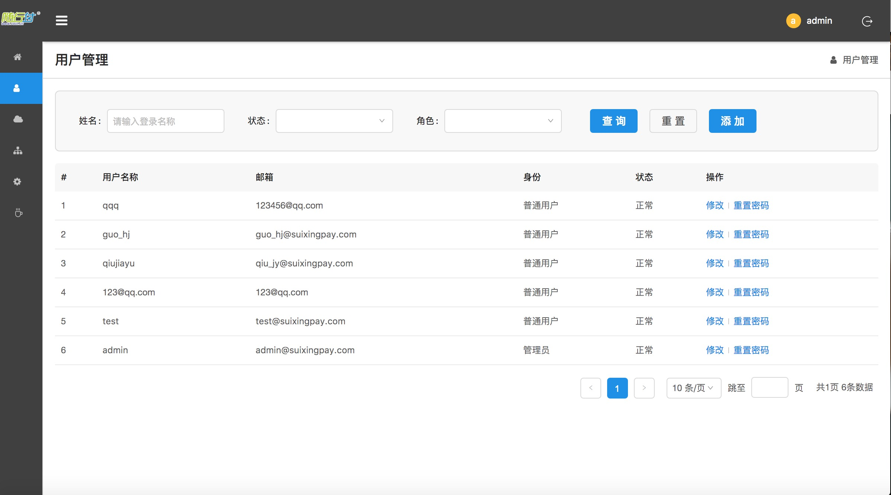
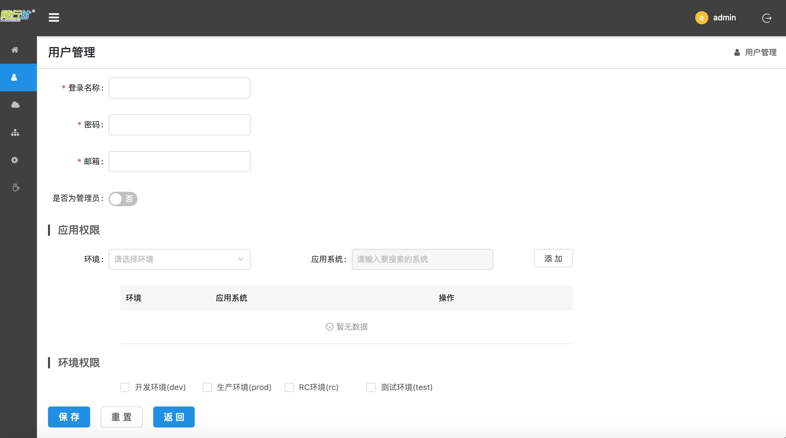
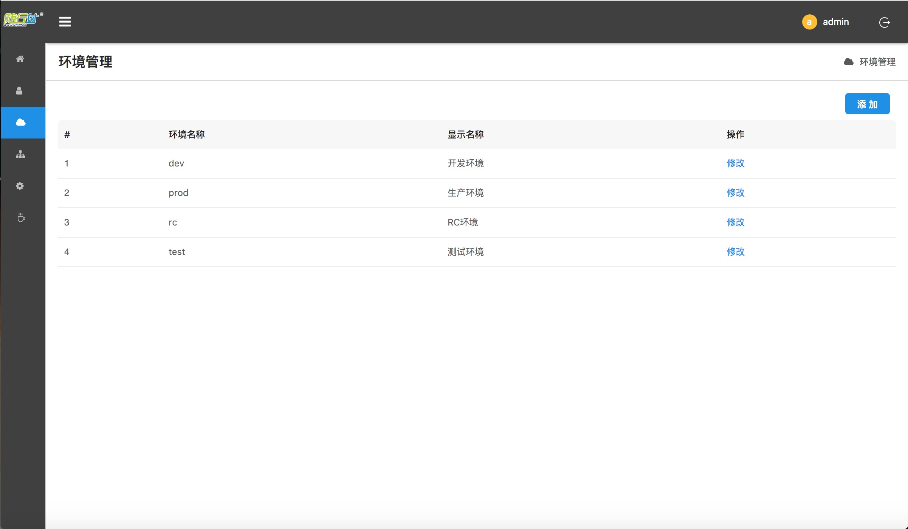
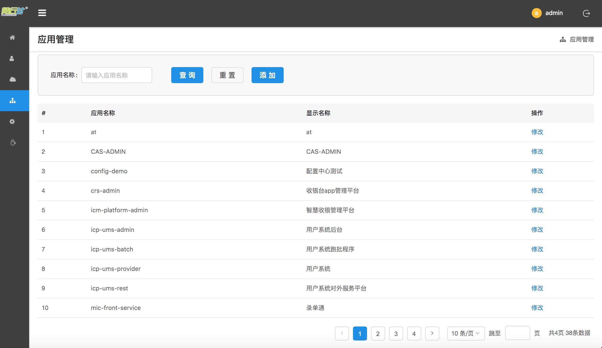
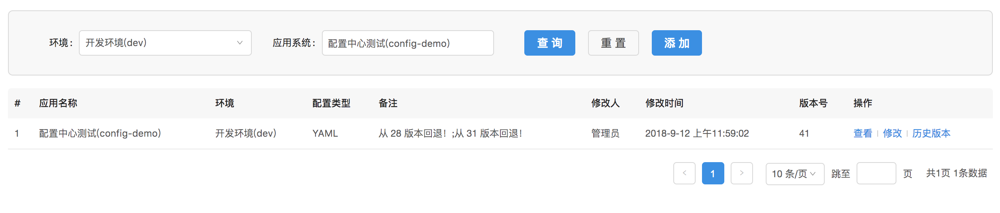
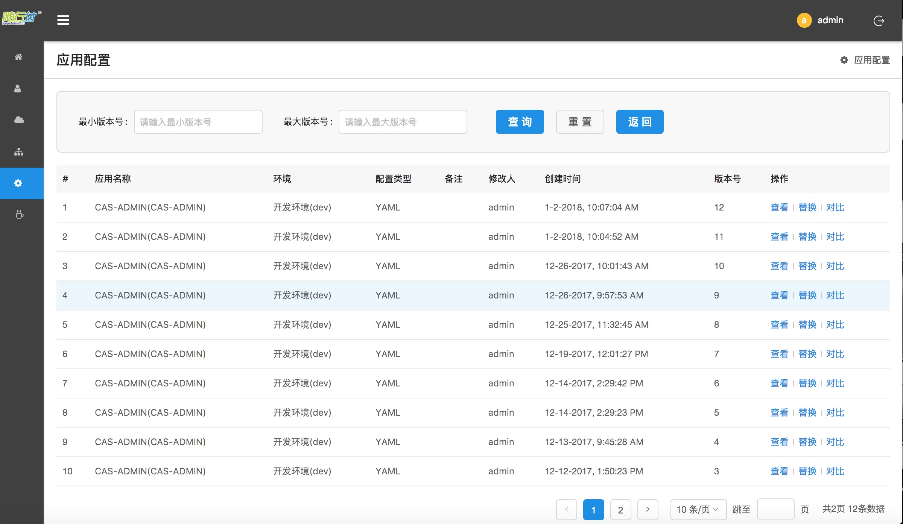
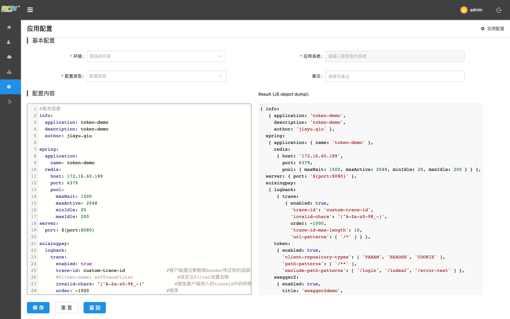
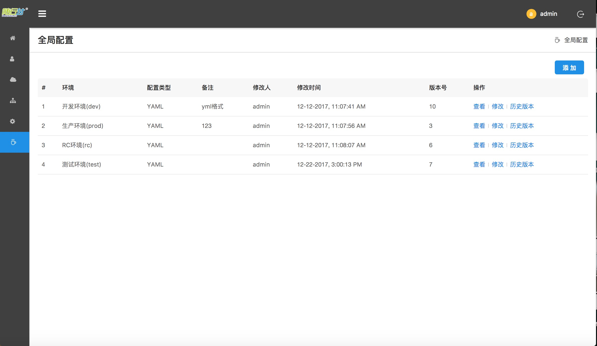

# 配置中心使用手册

作者：汤启华

------

## 1. 用户管理
+ **用户管理界面**
    
    * 建议首次登陆点击右上角的用户名进行**修改密码**
    * 用户名右侧为**退出登陆**
+ **添加用户**
    
    + 是否为管理员 ： 管理员，普通用户（普通用户只有应用配置和全局配置权限,注意：没有管理应用的权限）
    + 应用权限 ：分配给用户**在配置中心的应用**的配置权限，即该账户能够配置的对应环境的应用系统配置
    + 环境权限 ：分配指定环境的配置权限
    * 其他 ： 用户修改时可以停用账户

## 2. 环境管理

## 3. 应用管理

**注意：配置的应用名必须和spring.application.name一致，这样配置才能匹配上**
## 4. 应用配置（主要）

+ 版本号 ：每次配置会默认提供从1递增的版本号进行版本控制

+ 替换 ：更换版本
+ 对比 ：查看两个版本的修改

+ 基本配置 ： 
    * 环境 ：环境数据项下拉
    * 应用系统 ：应用管理中的数据，动态查询下拉
    * 配置类型 ： 暂只支持YAML
    * 备注 ：操作说明等
+ 配置内容 ：
    直接粘贴配置到左方框，会解析成JSON
    若解析失败，请注意格式问题
        
## 5. 全局配置
